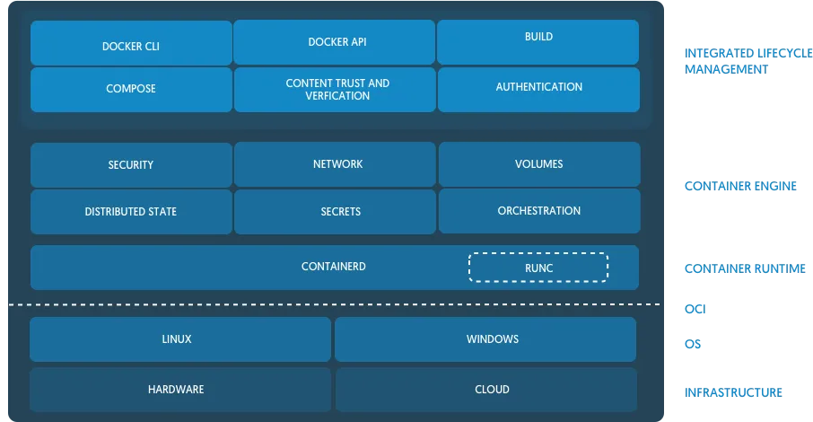

# Container 容器技术

## 一、容器技术规范

从 2013 年 Docker 横空出世（开源），席卷整个 IT 产业，到现在 2020 年，绝大部分新项目都是使用容器进行部署了。
任何技术发展到一定程度，都一定会「规范化」「标准化」。容器技术不断发展，各家大厂（Google、IBM、RedHat、AWS 等）都希望容器技术能有一个开放的标准，大家都能参与标准的指定，保存不会被任何公司垄断技术核心。
于是这些大厂们带（bi）着（po） Docker 搞出了 [OCI(Open Container Initiative，开放容器倡议)](https://github.com/opencontainers)，这个组织负责为容器相关的各种技术制定开放的标准。

目前已经 OCI 已经完成了两个规范（标准）的制定：

1. [OCI 容器运行时规范](https://github.com/opencontainers/runtime-spec)
1. [OCI 镜像格式规范](https://github.com/opencontainers/image-spec)

另外还有一个未完成的规范：

- [OCI 镜像分发规范](https://github.com/opencontainers/distribution-spec)

### 容器网络接口（Container Networking Interface, CNI）

上面的规范完成了「镜像构建」-「镜像分发」-「容器运行」三个阶段的标准化，现在容器能运行起来了，但是还有一个问题：**网络**。
直接运行起来的容器，和别的容器之间是完全隔离的，无法互相通信。为了解决这个问题，还需要一个新的规范：

- [CNI](https://github.com/containernetworking/cni): 容器网络接口

CNI 只是定义了一套标准的「网络插件」和「容器运行时」之间的接口，使任何兼容此接口的「网络插件」和「容器运行时」之间都能正常交互。

CNI 主要是提供给 Kubernetes 这类容器集群系统的，这是一个蓬勃发展的领域。
而单机的容器网络，Docker 已经做得很好了，也没哪个公司想去把这个东西再重新做一遍（因为没多大价值、也没啥优化空间）。

你可以查看 CNI 的 README.md 获得更多信息。

### 容器数据卷接口(Container Storage Inteface, CSI)

和容器网络接口一样，容器数据卷规范 CSI 也是一个针对容器集群的规范，主要是 Kubernetes 用。
不深入讨论。 

## 二、容器相关的开源项目

前面介绍了 OCI 指定的三个容器相关标准，接下来该讨论兼容该标准的各类工具了。

网上能搜得到一些对 `runc`/`cri-o`/`containerd`/`docker`/`podman` 进行比较的文章，写得还算可以。
但是网上的文章没有讲清楚这些组件在整个容器生态中处于一个什么位置，只是笼统地介绍一下优缺点，使人云里雾里，一知半解。

这里我遵循一个自底向上的介绍方法，顺序介绍：

1. 容器运行时：
   1. `runc`/`crun`: 最底层的组件，只负责容器的运行。
   2. `containerd`/`cri-o`: 封装了 `runc`，管理整个容器的生命周期（创建、运行、销毁）
2. 容器镜像、存储、网络等
   1. `docker engine`/`podman`
   2. `docker-cli`/`kaniko`/`buildah` 等等

这样我们能对各个工具有更清晰的理解。

### 容器运行时

- [runc](https://github.com/opencontainers/runc): OCI 官方的「容器运行时规范」标准实现：
  - `runc` 最初由 Docker 公司捐献，由 Go 语言编写
- [crun](https://github.com/opencontainers/runc): 功能和 `runc` 完全一致，但是是 C 语言写的，速度更快。

但是 `runc` 非常底层，它只负责容器的**运行**，别的一概不管。它甚至不能识别容器镜像！
你需要先使用别的工具创建一个符合规范的容器，然后才能使用 `runc` 去运行它。

我们需要更强大、更上层的工具来管理容器的整个生命周期，主要有如下两个工具：

- [containerd](https://github.com/containerd/containerd): 在 2016 年由 docker 公司捐献给开源社区。
  - containerd 安装上 [containerd/cri](https://github.com/containerd/cri) 插件，就能支持 CRI 接口
- [CRI-O](https://github.com/cri-o/cri-o): OCI-based Container Runtime Interface
  - 原生支持 CRI 接口。

上述两个项目提供了完全相似的功能，未来可能大部分项目都会开始使用 CRI-O。

因为这两个项目都支持 CRI，我们可以使用 [cri-tools](https://github.com/kubernetes-sigs/cri-tools) 来直接调用它们进行容器相关操作。

#### Docker Engine vs Podman

`docker engine(dockerd)` 就建立在 `containerd` 之上，添加了数据卷、网络等功能。它们组合起来就是 Docker，结构如下：

而越来越受关注的另一个项目 [Podman](https://github.com/containers/libpod) 和 `docker engine(dockerd)` 完全类似，
它和 [CRI-O](https://github.com/cri-o/cri-o) 使用完全一致的底层组件
（[containers/image](https://github.com/containers/image)/
[containers/storage](https://github.com/containers/storage)/
[CNI](https://github.com/containernetworking/cni) 等）
来实现和 `docker engine` 一致的功能，并且不需要运行一个后台进程（daemon）.

#### Docker vs Others

除了 Podman 对标 `Docker Engine`，大厂还推出了各种工具，势要完全消除掉 Docker 的不可替代性。

镜像构建：

1. [Kaniko - GoogleContainerTools](https://github.com/GoogleContainerTools/kaniko): Goole 家的
2. [buildah](https://github.com/containers/buildah): RedHat 贡献给社区的
3. [buildkit](https://github.com/moby/buildkit): Docker 家的

与镜像仓库(Registry)交互：

1. [skopeo](https://github.com/containers/skopeo)

总的来说，

## 参考资料

- [Open Repository for Container Tools](https://github.com/containers)
- [RunC 是什么？- 博客园](https://www.cnblogs.com/sparkdev/p/9032209.html)
- [Containerd 简介 - 博客园](https://www.cnblogs.com/sparkdev/p/9063042.html)
- [Crictl Vs Podman - RedHat](https://www.openshift.com/blog/crictl-vs-podman)

